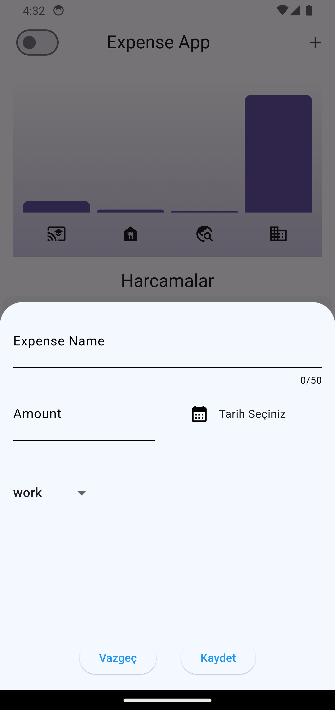
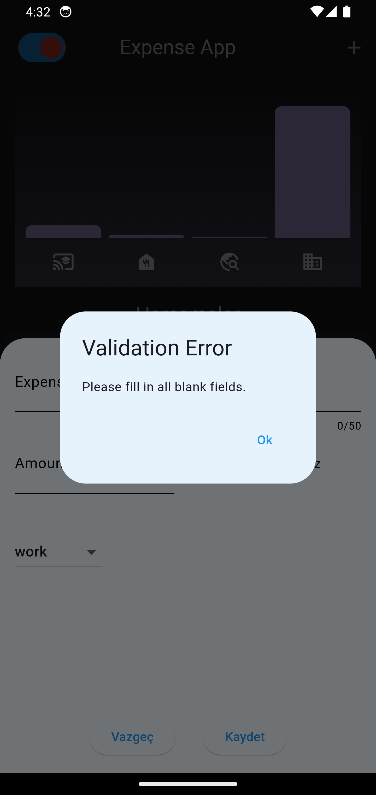

# expenseapp

Flutter ile geliştirilen, kullanıcının harcamalarını kontrol edebileceği ekleme ve silme işlemleri yapabileceği bir mobil uygulamadır.

## Proje içeriği
- model dosyası, harcama kategorilerini ve hesaplamalarını tutan modelleri içerir.
- intl paketi, tarih modelini yönetmemizi sağlar.
- chart bar paketi, harcama grafiklerini tutar ve harcama miktarına göre grafiği düzenler.

  

